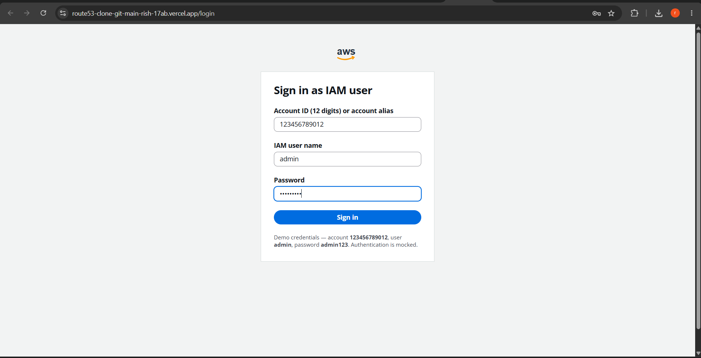
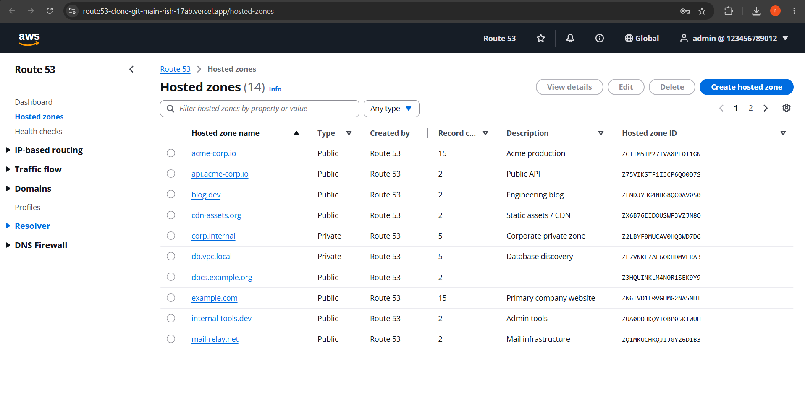
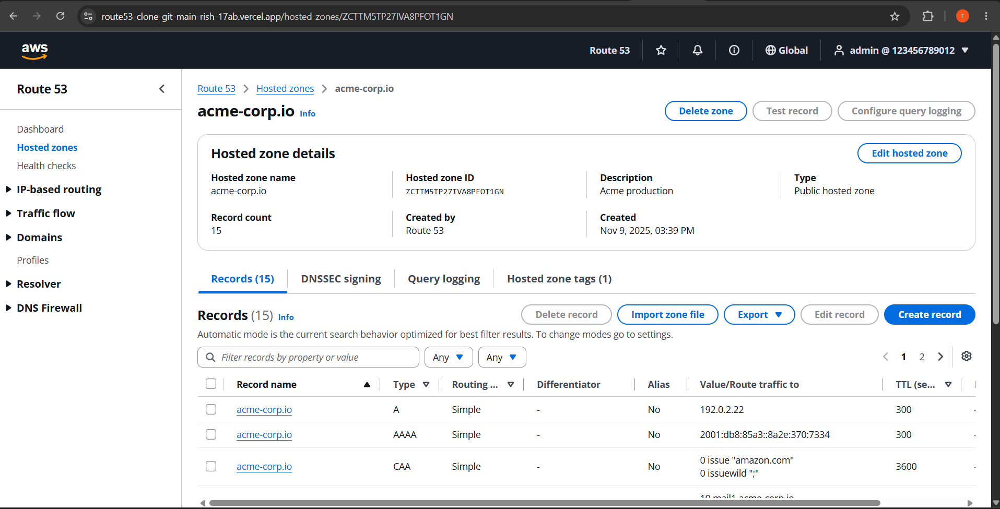
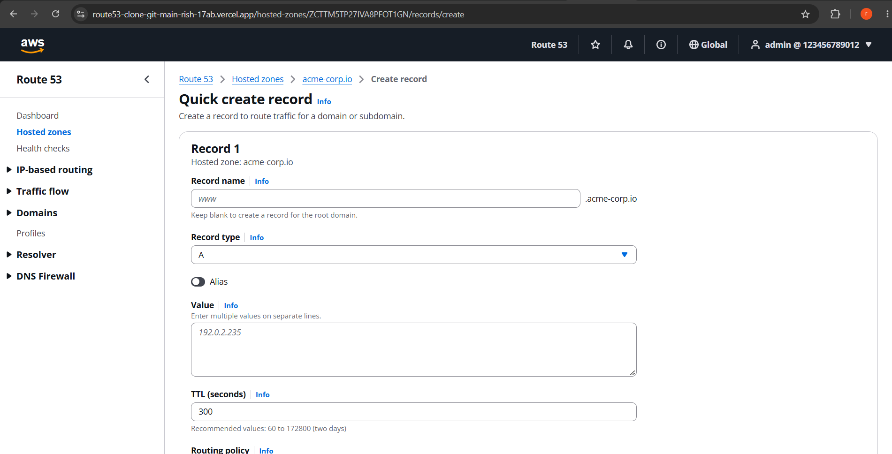
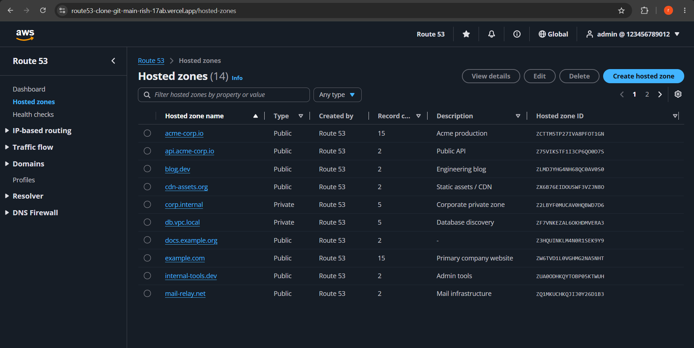

# AWS Route 53 Clone

A functional clone of the AWS Route 53 console: hosted zones, DNS records, mocked authentication and SQLite persistence.
No real DNS is implemented. The goal is to recreate the Route 53 **user experience and core workflows**.

## Live Demo

| | |
|---|---|
| **Application** | https://route53-clone-gamma.vercel.app |
| **API docs (Swagger)** | https://route53-clone-api-k8tv.onrender.com/docs |
| **Source code** | https://github.com/Rishita-06/route53-clone |

**Demo login:** Account ID `123456789012` · IAM user `admin` · Password `admin123`

> **Note on the hosted demo.** The backend runs on a free tier. The first request after a period of inactivity can take
> 30-60 seconds while the server wakes up. Free-tier storage is ephemeral, so the SQLite file is reset whenever the
> server redeploys or restarts; the demo data is re-seeded automatically. Persistence itself is fully implemented and
> works locally and on any host with a persistent disk.

## Screenshots

| Sign in | Hosted zones |
|---|---|
|  |  |

| Records | Create record |
|---|---|
|  |  |

| Dark mode |
|---|
|  |

## Tech Stack

| Layer | Technology |
|-------|------------|
| Frontend | Next.js 14 (App Router) + TypeScript + **Cloudscape Design System** |
| Backend | FastAPI + SQLAlchemy 2 + Pydantic v2 |
| Database | SQLite |

The UI is built with [Cloudscape](https://cloudscape.design), the open-source design system that the real AWS console
uses. Tables, forms, modals, flashbar notifications, side navigation and the top bar therefore match the original
look and feel.

## Features

**Authentication (mocked)**
- Login, logout and session persistence. The token is kept in `localStorage` and backed by a 7-day server-side session in SQLite.
- Expired or invalid sessions redirect to the sign-in page.

**Hosted zones**
- View, search, filter by type (public/private), sort and paginate, all server-side, with page-size and line-wrap preferences.
- Create public or private zones with a description and tags. New zones automatically receive NS and SOA records, as in the real service.
- Edit the description and tags.
- Delete with a type-`delete` confirmation. A zone that still has custom records needs an explicit "also delete all records" opt-in.

**DNS records**
- View, search, filter by type and routing policy, sort and paginate.
- Create, edit, delete and **bulk delete**.
- Supported types: `A`, `AAAA`, `CNAME`, `TXT`, `MX`, `NS`, `PTR`, `SRV`, `CAA` (`SOA` is read-only).
- Alias records (A / AAAA / CNAME) and Simple and Weighted routing policies.
- Per-type value validation, duplicate detection, the CNAME-coexistence rule, and protected apex NS/SOA records.

**Route 53 experience**
- AWS top bar, collapsible side navigation, breadcrumbs, flashbar notifications, confirmation modals, "Info" links and console-style copy and constraint texts.

**Placeholders** (a "Coming soon" page): Dashboard, Health checks, Traffic policies, Profiles, Resolver, Domains and the other sidebar sections.

**Bonus features**
- BIND zone-file **import** (multi-line parentheses, `$ORIGIN` / `$TTL`, relative names, optional overwrite).
- **Export** a hosted zone as JSON or BIND format.
- **Dark mode**, toggled from the top bar and persisted.
- **Bulk operations** (multi-select delete on records).

## Setup Instructions

### Prerequisites
- Python 3.11+
- Node.js 18+ and npm

### 1. Backend

```bash
cd backend
python -m venv .venv
source .venv/bin/activate        # Windows: .venv\Scripts\activate
pip install -r requirements.txt
uvicorn app.main:app --reload --port 8000
```

The API runs at http://localhost:8000 and the interactive docs are at http://localhost:8000/docs.
On first start the database file `backend/route53.db` is created and seeded with a demo user and 14 hosted zones with sample records.

### 2. Frontend

```bash
cd frontend
cp .env.example .env.local       # contains NEXT_PUBLIC_API_URL=http://localhost:8000
npm install
npm run dev
```

Open http://localhost:3000 and sign in with the demo credentials above.

### Docker alternative

```bash
docker compose up --build
```

Frontend at http://localhost:3000, backend at http://localhost:8000. The database is stored in a named volume.

### Tests and checks

```bash
cd backend && pytest             # API tests (auth, CRUD, validation, import/export, pagination)
cd frontend && npm run lint      # TypeScript type-check
```

### Environment variables

| Variable | Where | Purpose | Default |
|---|---|---|---|
| `NEXT_PUBLIC_API_URL` | frontend | Base URL of the backend API | `http://localhost:8000` |
| `DATABASE_URL` | backend | SQLAlchemy database URL | `sqlite:///./route53.db` |
| `CORS_ORIGINS` | backend | Comma-separated allowed frontend origins | `http://localhost:3000` |
| `CORS_ORIGIN_REGEX` | backend | Optional regex for extra allowed origins (e.g. preview deployments) | none |

## Architecture Overview

```
frontend/src
  app/login                       sign-in page
  app/(console)/layout.tsx        auth guard + console shell
  app/(console)/hosted-zones/…    list, create, detail (tabs), record create/edit
  app/(console)/[section]         "Coming soon" placeholder pages
  components/                     ConsoleShell, RecordsTable, RecordForm, ZoneModals,
                                  ImportZoneModal, TagsEditor
  lib/                            typed API client, auth context, notifications,
                                  breadcrumbs, navigation config

backend/app
  main.py          app setup, CORS, lifespan (create tables + seed), error shaping
  models.py        SQLAlchemy models
  schemas.py       Pydantic request/response models
  auth.py          PBKDF2 password hashing, session dependency
  services.py      record validation/normalisation, zone bootstrap (NS/SOA)
  validators.py    per-record-type value rules
  bind.py          BIND zone-file parser and exporter
  routers/         auth, zones, records, zone_files
  seed.py          demo user and zones
```

**Design notes**
- Routers are thin; business rules live in `services.py` and `validators.py`.
- All list endpoints filter, sort and paginate on the server.
- The frontend has a single typed API client (`lib/api.ts`), React contexts for auth, notifications and breadcrumbs, and one shared form component for creating and editing records.
- Errors are returned in a consistent shape so the UI can show per-field and general messages.

## Database Schema

```
users          id PK
               account_id, username, display_name, password_salt, password_hash
               UNIQUE(account_id, username)

sessions       token PK
               user_id FK -> users (ON DELETE CASCADE)
               created_at, expires_at

hosted_zones   id PK (e.g. Z0123...)
               name (indexed), comment, is_private, vpc_id, vpc_region,
               tags JSON, created_by, created_at

dns_records    id PK
               zone_id FK -> hosted_zones (ON DELETE CASCADE)
               name, type, ttl (nullable for alias), values JSON[],
               alias_target JSON (nullable), routing_policy, set_identifier,
               weight (nullable), created_at, updated_at
               UNIQUE(zone_id, name, type, set_identifier)
               INDEX(zone_id, name)
```

Deleting a hosted zone cascades to its records; deleting a user cascades to their sessions.

## API Overview

All routes except login require the header `Authorization: Bearer <token>`. Interactive documentation is served at `/docs`.

| Method | Path | Purpose |
|---|---|---|
| POST | `/api/auth/login` | Sign in, returns a session token |
| POST | `/api/auth/logout` | Sign out |
| GET | `/api/auth/me` | Current user (session check) |
| GET | `/api/zones?search&type&sort&order&page&page_size` | List / search hosted zones |
| POST | `/api/zones` | Create a hosted zone (auto NS + SOA) |
| GET / PUT / DELETE | `/api/zones/{id}` | Read / edit / delete (`?force=true` on delete) |
| GET | `/api/zones/{id}/records?search&type&routing_policy&alias&sort&order&page&page_size` | List / search records |
| POST | `/api/zones/{id}/records` | Create a record |
| GET / PUT / DELETE | `/api/zones/{id}/records/{rid}` | Read / edit / delete a record |
| POST | `/api/zones/{id}/records/bulk-delete` | Body `{ "ids": [..] }` |
| POST | `/api/zones/{id}/import` | Body `{ "content": "<BIND text>", "overwrite": false }` |
| GET | `/api/zones/{id}/export?format=json\|bind` | Download the zone |
| GET | `/api/health` | Health check |

Errors have the form `{ "detail": "message", "fields": { ... } }` with status codes `400` (validation), `401` (unauthenticated), `404`, `409` (duplicate or conflict) and `422` (malformed request).

## Deployment

The live demo uses:

- **Backend on Render** (Docker). The repository includes a `render.yaml` blueprint. Set `CORS_ORIGINS` to the frontend URL.
  To keep data across restarts, attach a persistent disk mounted at `/data` (`DATABASE_URL=sqlite:////data/route53.db`).
- **Frontend on Vercel.** Import the repository, set the root directory to `frontend`, and set `NEXT_PUBLIC_API_URL` to the backend URL (no trailing slash).

## Known Limitations

- IAM, accounts, Organizations and billing are mocked.
- Only Simple and Weighted routing policies are implemented; other policies appear disabled.
- "Test record", DNSSEC signing and query logging are placeholders.
- The free-tier demo backend sleeps when idle and resets its database on redeploy.
- Keyboard shortcuts are not implemented.
